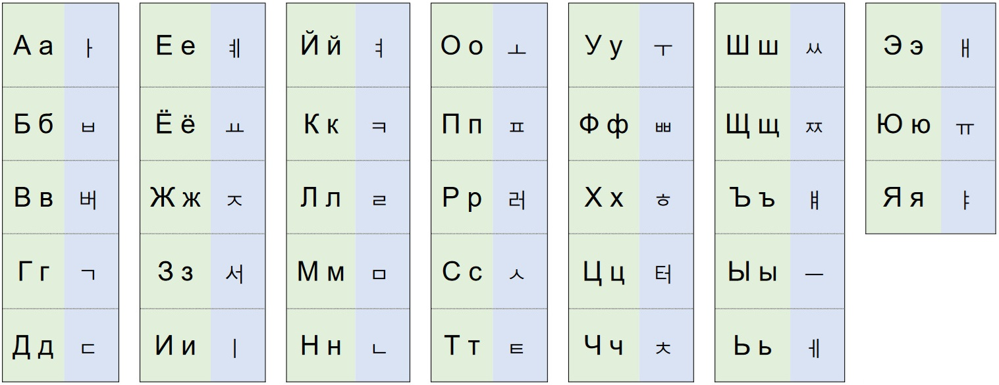

RU / [러우](https://github.com/dobrosketchkun/rukor/blob/main/README_KR.md) / [EN](https://github.com/dobrosketchkun/rukor/blob/main/README_EN.md)


Этот репозиторий содержит продолжение экспериментов с письменностью русского языка, как например [rulat](https://github.com/dobrosketchkun/rulatwiki) и [abominoto sans](https://github.com/dobrosketchkun/Abominoto-Sans). Вдохновением стало видео [How Korea's alphabet is saving an Indonesian dialect](https://www.youtube.com/watch?v=0dtTBDEXVYY)

Собственно, запись русского языка при помощи Хангыль:



Я старался сделать так чтобы соответствия были наиболее логичными, но там есть некоторые решения с потолка, что, впрочем, не слишком удивительно в этом случае, недостающие буквы надо было откуда-то брать.

### Пример:

```Алисе надоело сидеть на пригорке рядом с сестрой и ничего не делать. ```

```아리세 나도여로 시데테 나 ㅍ러이고러케 러야돔 ㅅ 솃ㅌ러오여 이 니쳬고 녜 뎨로테.```

Ещё один вариант написания:

```아릿예 낟오예로 싣예테 나 ㅍ러이고러켸 러야돔 ㅅ 솃ㅌ러오여 이 닟예고 녜 뎰아테.```

Он может быть получен при помощи скрипта [rukor.py](https://github.com/dobrosketchkun/rukor/blob/main/rukor.py)
